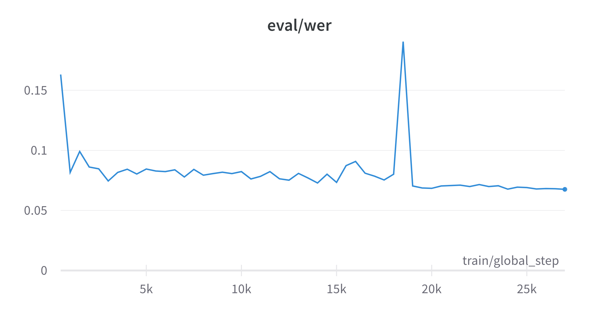

# ASL Speech to text model

A fine-tuning algorithm for Wav2Vec2 for SpeechRecognition model used in the ASL Learning App. 
Facebook AI's [wav2vec 2.0](https://github.com/pytorch/fairseq/tree/master/examples/wav2vec) is one of the
leading models in speech recognition. It is also available in the [Huggingface Transformers](https://github.com/huggingface/transformers) library.

The fine-tuned model will be available in the run directory under "saved model" folder and the mobile model 
under the "result" folder.

Due to the github size limit, we did not upload the model to the repository.

## How to Run
To train the model
```
python main.py --train
```

To train from a checkpoint
```
python main.py --train --runId <path-to-checkpoint-from-the-training>
```

To evaluate the model
```
python main.py --runId <path-to-run-folder-from-the-training>
```

To convert the model to lite mobile compatible

```
python main.py --convert_model --runId <path-to-run-folder-from-the-training>
```

## Result
Word Error Rate (WER) is a metric that is used in SpeechRecognition task for evaluation. <br />

The WER rate after fine tuning the wav2vec2-100h model is 0.0674%. <br />


Here is the results from fine-tuning the Wav2Vec2-100h model

| S.No | Predicted transcript                                                                                                       | Actual transcript                                                                                                                         |
|------|----------------------------------------------------------------------------------------------------------------------------|-------------------------------------------------------------------------------------------------------------------------------------------|
| 1    | A COLD LUCID INDIFFERENCE REIGNED IN HIS SOUL                                                                              | A COLD LUCID INDIFFERENCE REIGNED IN HIS SOUL                                                                                             |
| 2    | REDOFO ARRIVED AT HIS OWN HOUSE WITHOUT ANY IMPEDIMENT AND LEOCADIUS PARENTS REACHED THEIRS HEART BROKEN AND DESPAIRING    | RODOLFO ARRIVED AT HIS OWN HOUSE WITHOUT ANY IMPEDIMENT AND LEOCADIA'S PARENTS REACHED THEIRS HEART BROKEN AND DESPAIRING                 |
| 3    | I COULDN'T SHIVER MUCH BEING BOUND SO TIGHT BUT WHEN I'M LOOSE I MEAN TO HAVE JUST SWUNG GOOD SHIVER TO RELIEVE MY FELINGS | I COULDN'T SHIVER MUCH BEIN BOUND SO TIGHT BUT WHEN I'M LOOSE I MEAN TO HAVE JUS ONE GOOD SHIVER TO RELIEVE MY FEELIN'S                   |
| 4    | ALL IS SAID WITHOUT A WORD                                                                                                 | ALL IS SAID WITHOUT A WORD                                                                                                                |
| 5    | WELL NOW EUS I DECLARE YOU HAVE A HEAD AND SO HAS MY STICK                                                                 | WELL NOW ENNIS I DECLARE YOU HAVE A HEAD AND SO HAS MY STICK                                                                            0 |
| 6    | BEWARE OF MAKING THAT MYISTAKE                                                                                             | BEWARE OF MAKING THAT MISTAKE                                                                                                             |
