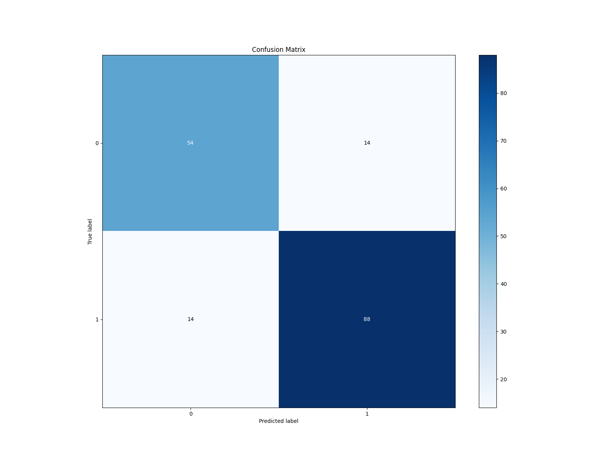
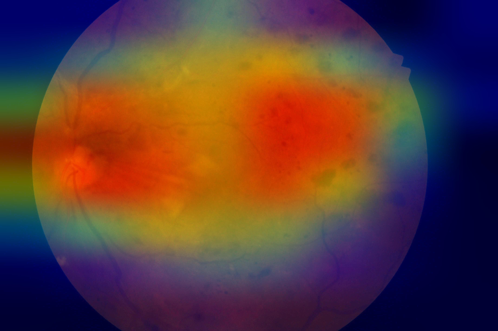
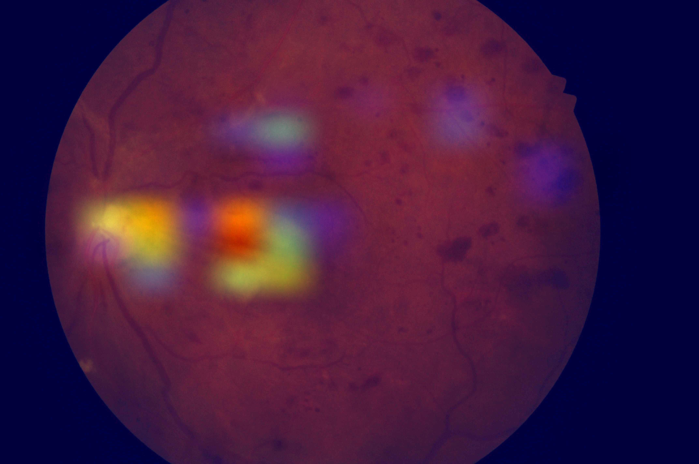

# Diabetic Retinopathy Detection

A CNN based Image Classification that classify the retinal fundus image based on the diagnosable level. 
We used three pretrained model ResNet50, EfficientNet- B4 and VGG16, and combined using ensemble voting technique.

## How to run
To train the model
```
python main.py --train
```

To train from a checkpoint
```
python main.py --train --runId <path-to-checkpoint-from-the-training>
```

To evaluate the model
```
python main.py --runId <path-to-run-folder-from-the-training>
```

## Result

### Test accuracy
| S.No | Model           | Percentage (%) |
|------|-----------------|----------------|
| 1    | Efficientnet-B4 | 79.5           |
| 2    | Resnet50        | 78.2           |
| 3    | VGG16           | 89.5           |
| 4    | Ensemble        | 83.5           |

### Confusion matrix for ensemble voting on test dataset <br />



### Grad cam results for a PDR class image <br />

EfficientNet-B4: <br />


ResNet50: <br />


VGG16: <br />
